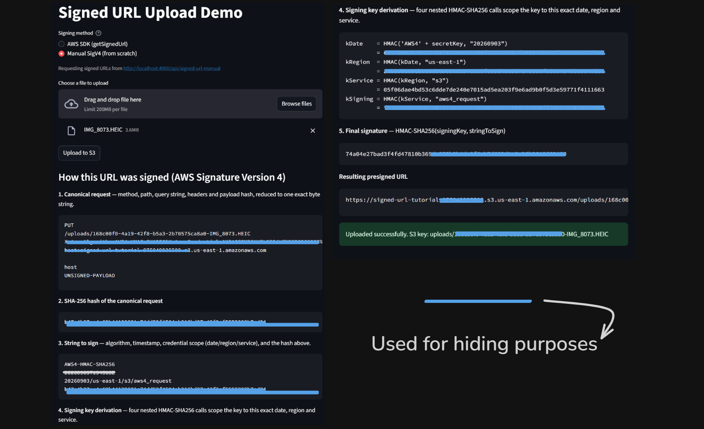

# Signed URL Upload Pipeline

<p align="center">
  
  
  
  
  
  
  
</p>

<p align="center">
  
</p>

A minimal, from-scratch example of the **signed URL upload pattern**: instead of files being uploaded through your own server, your server just hands out a temporary, permission-scoped URL, and the client uploads the file **directly to S3**.

It includes two ways to generate that URL — one using the AWS SDK, and one implementing AWS Signature Version 4 by hand, so you can see exactly what the SDK is doing under the hood.

## Why signed URLs?

If you naively route uploads through your backend, every file has to pass through your server's memory/disk before it reaches storage. That's slow, wastes bandwidth and compute, and doesn't scale well for large files or many concurrent uploads.

A signed URL is like a **temporary guest pass**: your backend (which holds the real AWS credentials) generates a URL that says *"whoever has this link can PUT one specific file, to one specific location, for the next 5 minutes — nothing else."* The backend never touches the file bytes at all. The client uploads straight to S3, and the pass expires on its own.

## How it works

```
┌─────────────┐   1. POST /api/signed-url          ┌─────────────┐
│  Streamlit  │   { filename, contentType }         │   Express   │
│   Client    │ ───────────────────────────────────>│   Backend   │
│  (Python)   │                                      │  (Node.js)  │
│             │   2. { uploadUrl, key, expiresIn }   │             │
│             │<─────────────────────────────────────│             │
└──────┬──────┘                                      └──────┬──────┘
       │                                                     │
       │ 3. PUT file bytes directly                          │ generates the
       │    to uploadUrl                                     │ presigned URL
       ▼                                                      │ (AWS SDK, or
┌─────────────┐                                               │ our own SigV4
│  AWS S3     │<──────────────────────────────────────────────┘ implementation)
│  Bucket     │
└─────────────┘
```

1. The client asks the backend for permission to upload a specific file.
2. The backend — which is the only party holding real AWS credentials — signs a short-lived URL scoped to exactly that file, and hands it back. It never sees the file itself.
3. The client uploads the file bytes straight to S3 using that URL. The URL stops working after it expires (default: 5 minutes).

## Two ways to sign the URL

| | `POST /api/signed-url` | `POST /api/signed-url-manual` |
|---|---|---|
| Signing done by | `@aws-sdk/s3-request-presigner` | Hand-written AWS Signature Version 4, using only Node's built-in `crypto` — no AWS SDK involved |
| Response | `{ uploadUrl, key, expiresIn }` | Same, plus a `steps` object with every intermediate value: the canonical request, its SHA-256 hash, the string to sign, the four-step HMAC key-derivation chain, and the final signature |
| Purpose | What you'd actually use in production | Understanding *why* the URL is valid — the Streamlit client renders `steps` on screen when this mode is selected |

Both produce URLs that S3 accepts identically — this was verified directly against a real bucket, including confirming S3 rejects a tampered signature with `403 SignatureDoesNotMatch`.

### The signing algorithm, in short

1. **Canonical request** — method, path, query string, headers, and payload hash reduced to one exact byte string. (S3 presigned URLs use the literal `UNSIGNED-PAYLOAD` here instead of hashing the body.)
2. **String to sign** — `AWS4-HMAC-SHA256` + timestamp + credential scope (`date/region/s3/aws4_request`) + SHA-256 hash of the canonical request.
3. **Signing key** — four nested HMAC-SHA256 calls: `HMAC(HMAC(HMAC(HMAC("AWS4"+secretKey, date), region), "s3"), "aws4_request")`. This scopes the derived key to one exact date/region/service instead of using the raw secret directly.
4. **Signature** — `HMAC-SHA256(signingKey, stringToSign)`, hex-encoded, appended to the URL as `X-Amz-Signature`.

See [`server/src/sigv4.js`](server/src/sigv4.js) for the full implementation.

## Project structure

```
Signed_URL/
├── server/                        Express API that issues signed URLs
│   ├── src/
│   │   ├── index.js                   app entrypoint
│   │   ├── loadEnv.js                 loads server/.env regardless of cwd
│   │   ├── s3Client.js                shared AWS SDK S3 client
│   │   ├── sigv4.js                   hand-rolled AWS SigV4 signer
│   │   ├── objectKey.js               builds a collision-safe S3 object key
│   │   ├── validateUploadRequest.js   shared request validation
│   │   └── routes/
│   │       ├── signedUrl.js           POST /api/signed-url (SDK)
│   │       └── signedUrlManual.js     POST /api/signed-url-manual (hand-rolled)
│   ├── package.json
│   └── .env.example
└── client/                        Streamlit app that performs the upload
    ├── app.py
    ├── requirements.txt
    └── .env.example
```

## Prerequisites

- Node.js 18+ and npm
- Python 3.9+ and pip
- An AWS account with a private S3 bucket and a scoped IAM user (see below)

## AWS setup

You need three things in your AWS account before running this:

1. **An S3 bucket** — create it with **Block all public access** left ON. The bucket never needs to be public; every upload goes through a presigned URL instead.
2. **An IAM policy** scoped to just that bucket:
   ```json
   {
     "Version": "2012-10-17",
     "Statement": [
       {
         "Effect": "Allow",
         "Action": "s3:PutObject",
         "Resource": "arn:aws:s3:::YOUR_BUCKET_NAME/*"
       }
     ]
   }
   ```
3. **An IAM user** (programmatic access only, no console login) with that policy attached, plus an access key generated for it.

This keeps the app's credentials limited to exactly one permission (`PutObject`) on exactly one bucket — if the key ever leaked, the blast radius is small.

## Configuration

Copy the example env files and fill in your own values:

```bash
cp server/.env.example server/.env
cp client/.env.example client/.env
```

**`server/.env`**

| Variable | Description |
|---|---|
| `PORT` | Port the Express API listens on (default `4000`) |
| `AWS_REGION` | Region your bucket lives in |
| `AWS_ACCESS_KEY_ID` / `AWS_SECRET_ACCESS_KEY` | Access key for the scoped IAM user above |
| `S3_BUCKET_NAME` | Your bucket's name |
| `URL_EXPIRY_SECONDS` | How long a signed URL stays valid (default `300`) |

**`client/.env`**

| Variable | Description |
|---|---|
| `API_BASE_URL` | Base URL of the backend API (default `http://localhost:4000/api`) — both `/signed-url` and `/signed-url-manual` are requested relative to this |

`.env` files are git-ignored — never commit real credentials, and never paste them into the `.env.example` templates either.

## Running it

**1. Start the backend:**
```bash
cd server
npm install
node src/index.js
```

**2. Start the client** (in a separate terminal):
```bash
cd client
pip install -r requirements.txt
streamlit run app.py
```

**3. Open [http://localhost:8501](http://localhost:8501)**, choose a signing method, pick a file, and click **Upload to S3**. When "Manual SigV4" is selected, the page renders every step of the signing process before performing the upload.

## API reference

### `POST /api/signed-url` and `POST /api/signed-url-manual`

Same request/response contract; `signed-url-manual` additionally returns `steps`.

**Request**
```json
{ "filename": "photo.jpg", "contentType": "image/jpeg" }
```

**Response**
```json
{
  "uploadUrl": "https://your-bucket.s3.us-east-1.amazonaws.com/uploads/....jpg?X-Amz-...",
  "key": "uploads/a1b2c3d4-photo.jpg",
  "expiresIn": 300
}
```

The client then does a plain `PUT` of the raw file bytes to `uploadUrl`. Note that only the `host` header is part of the signature (`X-Amz-SignedHeaders=host`) — the `Content-Type` you send on the PUT is stored as the object's metadata but isn't itself cryptographically checked against the signature.

## Security notes

- The bucket stays fully private the whole time — nothing is ever made public.
- Every signed URL is scoped to one object key and expires automatically.
- The IAM user backing the app can only `PutObject` — it can't read, list, or delete anything.
- There's currently **no auth** on either endpoint — anyone who can reach the API can request an upload slot. Fine for local learning/dev; add an auth check (API key, session, JWT) before exposing this publicly.
- The manual signer reads the same `AWS_SECRET_ACCESS_KEY` from `server/.env` as the SDK path — it's a different code path, not a different credential.

## Troubleshooting

| Problem | Likely cause |
|---|---|
| `EADDRINUSE` on server start | Port 4000 is already in use — a previous instance is still running |
| `403 SignatureDoesNotMatch` from S3 | Something in the canonical request/string-to-sign doesn't match what S3 expects — S3's error response includes its own computed `CanonicalRequest` and `StringToSign`, which you can diff against `steps` from `/api/signed-url-manual` |
| `403 Forbidden` (no `SignatureDoesNotMatch`) | The IAM policy, bucket name, or region in `.env` don't match what you created in AWS |
| Signed URL request returns `400` | `filename` or `contentType` missing/invalid in the request body |
| Streamlit can't reach the API | Confirm the backend is running and `API_BASE_URL` in `client/.env` points to the right port |
